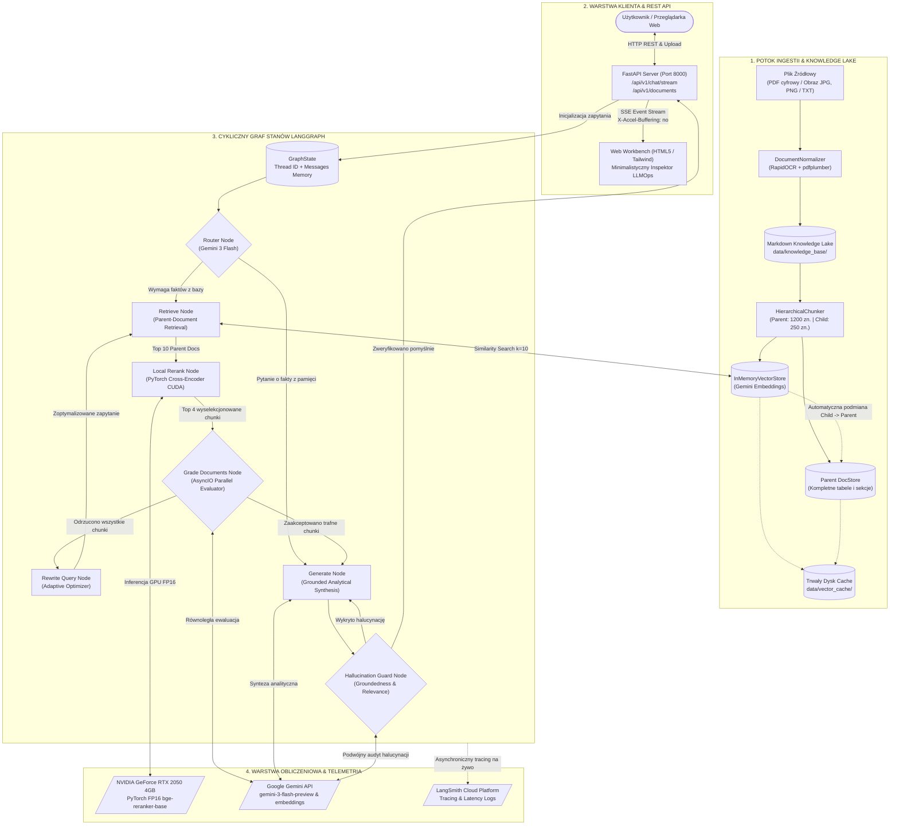
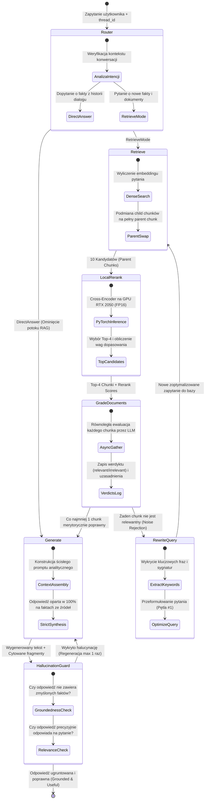
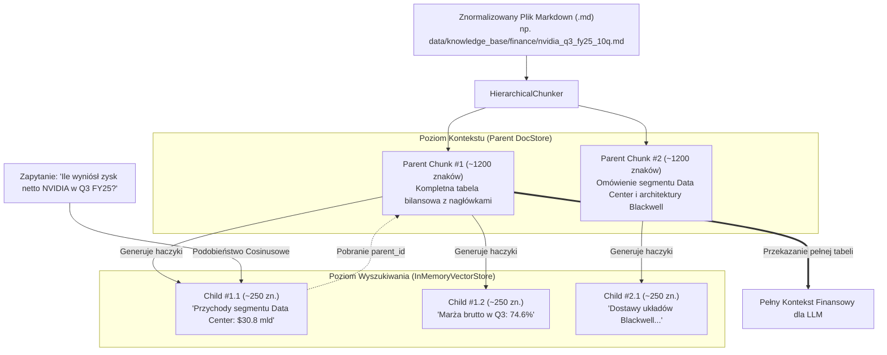

# Schemat Przepływu Danych — Enterprise Agentic RAG

Niniejszy dokument przedstawia pełny schemat architektury i przepływu danych w platformie **Enterprise Agentic RAG**. Obejmuje on potok ingestii dokumentów, hierarchiczne wyszukiwanie Parent-Document, cykliczny graf stanów LangGraph z pętlami samonaprawczymi, lokalny akcelerator PyTorch na GPU RTX 2050 oraz streaming telemetrii i tracing w LangSmith.

---

## 1. Architektura Globalna i Przepływ End-to-End

Poniższy diagram przedstawia drogę danych od wejścia użytkownika lub pliku źródłowego, przez silniki przetwarzania i akcelerację sprzętową, aż po streaming i audyt jakości.

---

## 2. Maszyna Stanów LangGraph (State Machine Lifecycle)

System bazuje na cyklicznym grafie stanów ze zintegrowaną pamięcią konwersacyjną (`MemorySaver`) oraz dwiema pętlami samonaprawczymi:

---

## 3. Wzorzec Parent-Document Retrieval (Podwójna Ziarnistość)

W celu wyeliminowania rozmycia semantycznego oraz bezstratnego zachowania struktur tabel bilansowych (np. sprawozdań 10-Q), system dzieli wiedzę na dwa komplementarne poziomy:

---

## 4. Schemat Strumienia Telemetrii SSE (Server-Sent Events)

FastAPI przesyła zdarzenia do przeglądarki w czasie rzeczywistym przez endpoint `/api/v1/chat/stream`:

| Zdarzenie SSE (`event`) | Węzeł (`node`) | Zawartość ładunku JSON (`data`) |
| :--- | :--- | :--- |
| `session` | - | Identyfikator sesji konwersacyjnej (`thread_id`) |
| `step` | `router` | Wybrany kierunek: `retrieve` lub `direct_answer`, czas trwania węzła w ms |
| `step` | `retrieve` | Lista surowych kandydatów z wektorówki (`index`, `filename`, `preview`, `is_table`) |
| `step` | `local_rerank` | Dokładne wagi Cross-Encodera (`score`), alokacja pamięci GPU VRAM w MB |
| `step` | `grade_documents` | Werdykty dla każdego chunku (`relevant`/`irrelevant`) wraz ze słownym uzasadnieniem LLM |
| `step` | `rewrite_query` | Informacja o pętli autokorekty: pierwotne zapytanie vs nowe zoptymalizowane |
| `step` | `generate` | Tekst odpowiedzi w Markdown oraz wykaz cytowanych źródeł (`citations`) |
| `step` | `hallucination_check` | Wyniki audytu: `grounded`/`not grounded` oraz `useful`/`not useful` |
| `complete` | - | Sygnał zakończenia generacji, całkowity czas przetwarzania (`total_time_ms`) |

---

## 5. Środowisko Sprzętowe i Optymalizacje

1. **Akceleracja GPU NVIDIA GeForce RTX 2050 (4096 MiB VRAM)**:
   - Dedykowany do inferencji Cross-Encodera `BAAI/bge-reranker-base`.
   - Obliczenia w półprecyzji `FP16` redukują narzut pamięci do poziomu ~350-480 MB VRAM, co gwarantuje stabilność pracy systemu.
2. **Współbieżność AsyncIO (HTTP/2 Multiplexing)**:
   - Węzły `grade_documents` oraz `hallucination_check` wykonują równoległe zapytania `ainvoke` przez `asyncio.gather`, co obniża czas odpowiedzi o ponad 50%.
3. **Trwałość Cache i Gotowość Produkcyjna**:
   - Stan indeksu wektorowego oraz słownik rodziców są trwale serializowane w `data/vector_cache/`, co umożliwia natychmiastowy start aplikacji bez powtórnego pobierania embeddingów.
