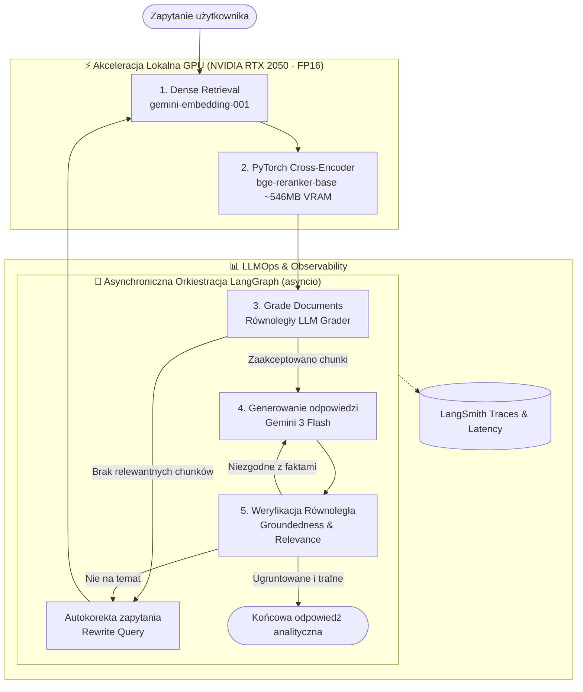

# 🧠 BigTech Financial Agentic RAG — AI Engineering & LLMOps

[](https://huggingface.co/spaces)
[](https://www.python.org/downloads/)
[](https://pytorch.org/)
[](https://github.com/langchain-ai/langgraph)
[](https://ai.google.dev/)
[](https://smith.langchain.com/)
[](LICENSE)

Zaawansowany, samonaprawczy system **Agentic RAG (Self-Corrective & CRAG)** oparty na **cyklicznych grafach stanów LangGraph**, łączący **lokalną inferencję PyTorch na GPU** (Cross-Encoder w `FP16`) z chmurowym modelem wnioskującym **Google Gemini 3 Flash** oraz pełnym monitoringiem telemetrycznym w **LangSmith**.

System analizuje sprawozdawczość finansową i technologiczną **„Wielkiej Szóstki” Big Tech** (NVIDIA, Alphabet, Microsoft, Amazon AWS, Meta, Apple), koncentrując się na nakładach Capex, autorskich chipach krzemowych AI oraz marżach operacyjnych.

---

## 🏛️ Architektura Systemu



---

## 🚀 Kluczowe Cechy i Innowacje

1. **Hybrydowa Architektura Obliczeniowa (Hybrid Compute)**:
   - **Lokalne GPU**: Precyzyjny Cross-Encoder (`BAAI/bge-reranker-base`) uruchomiony w `torch.float16` na dedykowanej karcie graficznej. Reranking 10 kandydatów zajmuje zaledwie **~369 ms**, nie generując kosztów tokenów API.
   - **Chmura**: **Gemini 3 Flash** odpowiada za rozumowanie, ekstrakcję faktów i binarne decyzje logiczne.
2. **Pętla Samonaprawcza (Self-Correction & Guardrails)**:
   - Graf automatycznie wykrywa nieadekwatne fragmenty i przepisuje zapytania w terminologii rynków kapitałowych.
   - Wbudowane sztywne bezpieczniki cykli (`regeneration_count < 1`, `retry_count < 2`) uniemożliwiają nieskończone pętle agentowe.
3. **Asynchroniczna Współbieżność (`asyncio.gather`)**:
   - Wszystkie fragmenty w węźle ewaluacji oceniane są równolegle w jednym locie HTTP/2.
   - Testy ugruntowania w faktach (*Groundedness*) i celności (*Relevance*) wykonują się jednocześnie.
   - **Skrócenie czasu odpowiedzi o ponad 50%**.
4. **Persistent Vector Cache**:
   - Zapis wygenerowanych embeddingów do zserializowanego pliku `data/vector_cache/index.json`.
   - Baza 6 korporacji technologicznych ładuje się z dysku w **0.50 s** (poniżej sekundy, bez zapytań sieciowych).
5. **Wielka Szóstka Big Tech (Financial Knowledge Base)**:
   - Autorskie układy krzemowe AI: Google TPU v5p/Trillium, AWS Trainium 2, Microsoft Azure Maia 100, Meta MTIA v2, Apple M4 Private Cloud Compute vs GPU NVIDIA Blackwell.
   - Bilanse Capex i przychody chmurowe AWS, Azure i Google Cloud.

---

## 📂 Struktura Projektu

```text
ai-engineering-lab/
├── data/
│   ├── financial_reports/       # Sprawozdania źródłowe (NVIDIA, Alphabet, Microsoft, Amazon, Meta, Apple)
│   └── vector_cache/            # Trwały zserializowany indeks wektorowy (index.json)
├── src/
│   ├── nodes/                   # Węzły cyklicznego grafu stanów
│   │   ├── retrieve_node.py     # Pobieranie gęste z bazy wektorowej
│   │   ├── rerank_node.py       # Inferencja Cross-Encodera na GPU
│   │   ├── grade_node.py        # Asynchroniczny filtr jakości chunków (asyncio)
│   │   ├── rewrite_node.py      # Autokorekta i transformacja zapytań
│   │   ├── generate_node.py     # Synteza faktograficzna z Gemini 3 Flash
│   │   └── hallucination_node.py# Równoległa detekcja halucynacji i celności
│   ├── reranker/
│   │   └── local_reranker.py    # Singleton PyTorch FP16 na CUDA
│   ├── retriever/
│   │   └── vector_store.py      # FinancialVectorStore z obsługą dyskowego cache
│   ├── utils/
│   │   └── async_runner.py      # Bezpieczny egzekutor pętli asyncio
│   ├── config.py                # Pydantic Settings i konfiguracja środowiska
│   ├── state.py                 # Silnie typowany GraphState (TypedDict)
│   ├── graph.py                 # Kompilacja StateGraph z routingiem warunkowym
│   └── run_agent.py             # Konsolowy interfejs CLI ze streamingiem węzłów
├── tests/                       # Pakiet 14 testów jednostkowych i integracyjnych
│   ├── test_reranker.py         # Testy VRAM, Singletona i dokładności scoringu
│   ├── test_retriever.py        # Testy bazy wektorowej i wymiarów wektorów
│   ├── test_graph.py            # Testy end-to-end cyklicznego grafu
│   └── test_large_knowledge_base.py # Benchmark GPU i zapytania porównawcze
├── .env.example                 # Szablon zmiennych środowiskowych
├── PROJECT_STATE.md             # Żywy rejestr stanu projektu i decyzje architektoniczne (ADR)
└── README.md                    # Dokumentacja techniczna
```

---

## ⚡ Szybki Start

### 1. Klonowanie i Środowisko
```bash
git clone https://github.com/michalkocher-development/bigtech-financial-agentic-rag.git
cd bigtech-financial-agentic-rag

python -m venv .venv
# Windows PowerShell:
.\.venv\Scripts\Activate.ps1
# Linux/macOS:
source .venv/bin/activate

pip install -r requirements.txt
```

### 2. Konfiguracja Kluczy API
Skopiuj plik `.env.example` do `.env`:
```bash
cp .env.example .env
```
Uzupełnij klucze w pliku `.env`:
- `GOOGLE_API_KEY`: Twój klucz do modeli Google Gemini ([Google AI Studio](https://aistudio.google.com/)).
- `LANGCHAIN_API_KEY`: Twój klucz z platformy [LangSmith](https://smith.langchain.com/).

### 3. Uruchomienie Zestawu Testów
Wszystkie testy uruchamiają się lokalnie, weryfikując akcelerację CUDA oraz integrację grafu:
```powershell
pytest tests/ -v
```
> **Status testów**: `14 passed in ~63s` ✅

### 4. Uruchomienie Agenta w Konsoli (CLI)
Zadaj dowolne pytanie analityczne bezpośrednio z wiersza poleceń:
```powershell
python src/run_agent.py "Porównaj przychody z chmury AWS i Google Cloud w 2024 roku oraz ich rentowność."
```

---

## 📊 Metryki i Benchmarki

| Obszar / Metryka | Wynik | Komentarz |
| :--- | :---: | :--- |
| **Zużycie VRAM (RTX 2050)** | **~546 MB** | Bezpieczny margines pamięci (<14% z 4 GB VRAM) |
| **Opóźnienie Rerankera GPU (10 chunków)** | **~369 ms** | Czysty forward-pass w `torch.float16` na CUDA |
| **Optymalizacja AsyncIO (Grading & Evals)** | **-52% czasu** | Zrównoleglenie wywołań w jednym locie HTTP/2 |
| **Ładowanie Bazy Wektorowej z Dysku** | **0.50 s** | Persistent Vector Cache eliminuje koszt embeddingów |
| **Pokrycie Testami Regresyjnymi** | **14 / 14 (100%)** | Testy jednostkowe, integracyjne i benchmarki |

---

## 🛡️ Architektura Decyzji (ADR)
Wszystkie kluczowe decyzje technologiczne są udokumentowane w pliku [`PROJECT_STATE.md`](PROJECT_STATE.md):
- **ADR-001**: Strategia dwuwarstwowej pamięci agenta (`GEMINI.md` + `PROJECT_STATE.md`).
- **ADR-002**: Środowisko chmurowe LocalStack / moto bez ponoszenia kosztów AWS.
- **ADR-003**: Hybrydowa alokacja compute (PyTorch na RTX 2050 + Cloud Gemini).
- **ADR-004**: Wybór modeli Gemini 3 Flash oraz Gemini Embeddings.
- **ADR-005**: Baza sprawozdawczości Big Tech o wysokiej gęstości faktograficznej.
- **ADR-006**: Asynchroniczna współbieżność ewaluacji (`asyncio.gather` + `ainvoke`).

---

## 👨‍💻 Autor
**Michał Kocher**  
GitHub: [@michalkocher-development](https://github.com/michalkocher-development)
